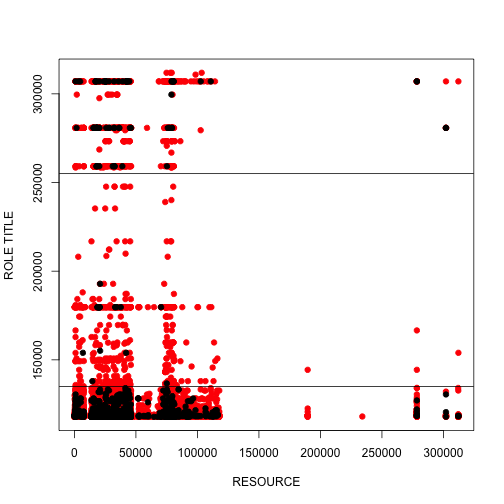

# Data exploration on raw data for Amazon project

### Setting 

```r
setwd("/Users/aszostek/Projects/Kaggle/Amazon")
source("./Utils/utils.R")
train <- read.csv(file = "./Data/train.csv")
test <- read.csv(file = "./Data/test.csv")
```


## Metric in this competition is AUC interpreted as:
* You do your classification and classify as 0 or 1
* Repeat - randomly choose one observation from set classified as 0 and one from set classified as 1
* Check if classification was true for both observations
* The area under the curve is the percentage of pairs with both observations classified correctly.
* That is why if you made a random classification, this will be equal ~0.5


## How many resources there are?

```r
length(unique(train[[2]]))
```

```
## [1] 7518
```

7k resources!!! that is a lot! In particular that there are only .. rows


```r
nrow(train)
```

```
## [1] 32769
```

How many managers?

```r
length(unique(train[[3]]))
```

```
## [1] 4243
```

```r
length(unique(train[[4]]))
```

```
## [1] 128
```

```r
length(unique(train[[5]]))
```

```
## [1] 177
```

```r
length(unique(train[[6]]))
```

```
## [1] 449
```

```r
length(unique(train[[7]]))
```

```
## [1] 343
```

```r
length(unique(train[[8]]))
```

```
## [1] 2358
```

```r
length(unique(train[[9]]))
```

```
## [1] 67
```

```r
length(unique(train[[10]]))
```

```
## [1] 343
```

What are the most common resources requested?

```r
tb <- table(train[[2]])
cou <- factor(train[[2]], levels = names(tb[order(tb, decreasing = F)]))
# table(cou)
```

 Were they accepted or not? What are the resources that are rejected the most? Lets look for example resource 4675

```r
res = train[train$RESOURCE == 4675, ]
table(res[[1]])
```

```
## 
##   0   1 
##   3 836
```

It seems that in this resource, majority requests are accepted!

```r
res = train[train$RESOURCE == 79092, ]
table(res[[1]])
```

```
## 
##   0   1 
##  16 468
```

Here too

```r
res = train[train$RESOURCE == 75078, ]
table(res[[1]])
```

```
## 
##   0   1 
##   4 405
```

and here too

```r
res = train[train$RESOURCE == 25993, ]
table(res[[1]])
```

```
## 
##   0   1 
##  19 390
```


```r
res = train[train$RESOURCE == 3853, ]
table(res[[1]])
```

```
## 
##   0   1 
##   6 398
```

### Question:
Are there any resources in test file that are not in training set? 

```r
a1 <- unique(train[[2]])
a2 <- unique(test[[2]])
length(setdiff(a1, a2))
```

```
## [1] 2547
```

#### Answer: yes there are more than 2000 of them!

### Question: What would be the accuracy if I set all actions to one for the training set?

```r
table(train[[1]])
```

```
## 
##     0     1 
##  1897 30872
```

```r
a1 <- length(train[train$ACTION == 1, ])
1 - a1/nrow(train)
```

```
## [1] 0.9997
```

#### Answer: It seems like a pretty good accuracy to me :)

### Question: Is the data normalized?

```r
par(mfrow = c(1, 2))
plot_summary(train, main = "Training set")
```

```
## Error: unused argument(s) (main = "Training set")
```

```r
plot_summary(test, main = "Test set")
```

```
## Error: unused argument(s) (main = "Test set")
```

#### Answer:
* It seems it is
* For variables 4-10 the means are similar
* Variables 7 and 10 have very high minima compared to variables 4, 6, 8, 9
* the 1st quantile of variables 4-10 is almost identical
* also the median is almost identical
* I suspect that there was some effort to assign the numbers to categories in a sensible way!


### Question: Which managers accept resources more than others
* red - action 1
* black - action 0

```r
par(xpd = FALSE)
plot(train[train$ACTION == 1, c(2, 3)], col = "red", pch = 19, ylab = "MANAGER")
points(train[train$ACTION == 0, c(2, 3)], col = "black", pch = 19)
abline(h = 140000)
abline(h = 50000)
abline(h = 70000)
abline(h = 5000)
```

 

#### Answer:
* Managers with number > 140,000 seem to accept all/majority requests!

### Question: What is the ratio of accepted vs rejected for given resource? or manager? Lets find the most problematic resources and managers!


```r
par(mfrow = c(1, 2))
res <- unique(train[[2]])
v = c()
for (i in res) {
    
    acc1 <- length(train[train$ACTION == 1 & train$RESOURCE == i, 1])
    acc0 <- length(train[train$ACTION == 0 & train$RESOURCE == i, 1])
    v <- append(v, as.numeric(acc0/(acc1 + 1)))
    # print(acc0/(acc1+1))
}
plot(v ~ res, xlim = c(0, 150000), pch = 19, xlab = "Resource number", ylab = "Nb of acceptances / Nb of rejections")

res <- unique(train[[3]])
v = c()
for (i in res) {
    # acc1 <- length(train[train$ACTION==1 & train$MGR_ID == i,1])
    acc0 <- length(train[train$ACTION == 0 & train$MGR_ID == i, 1])
    acc <- length(train[train$MGR_ID == i, 1])
    v <- append(v, as.numeric(acc0/acc))
    # print(acc0/(acc1+1))
}
plot(v ~ res, xlim = c(0, 150000), pch = 19, xlab = "Manager number", ylab = "Ratio of rejections to all requests")
```

 

### Question: How does Role title correlate with acceptance?

```r
par(xpd = FALSE)
plot(train[train$ACTION == 1, c(2, 7)], col = "red", pch = 19, ylab = "ROLE TITLE")
points(train[train$ACTION == 0, c(2, 7)], col = "black", pch = 19)
abline(h = 135000)
abline(h = 255000)
```

 

#### Answer: 


### Similar plots for all variables!

```r
resource_acceptance <- function(column) {
    par(xpd = FALSE)
    plot(train[train$ACTION == 1, c(2, column)], col = "red", pch = 19)
    points(train[train$ACTION == 0, c(2, column)], col = "black", pch = 19)
}

par(mfrow = c(3, 3))
resource_acceptance(3)
resource_acceptance(4)
resource_acceptance(5)
resource_acceptance(6)
resource_acceptance(7)
resource_acceptance(8)
resource_acceptance(9)
resource_acceptance(10)
```

 


### Question: what is left if we eliminate the clear acceptance cases?

```r
rest <- subset(train, train$MGR_ID < 14000 & train$ROLE_CODE < 128000 & train$RESOURCE < 
    150000 & (train$ROLE_TITLE < 150000 | train$ROLE_TITLE > 290000) & train$ROLE_ROLLUP_2 < 
    135000 & train$ROLE_ROLLUP_2 > 50000 & train$ROLE_ROLLUP_1 < 122000 & train$ROLE_ROLLUP_1 > 
    1e+05 & (train$RESOURCE < 49000 | train$RESOURCE > 69000) & (train$ROLE_ROLLUP_2 > 
    128000 | train$ROLE_ROLLUP_2 < 124000) & (train$MGR_ID < 9500 | train$MGR_ID > 
    13000) & train$ROLE_FAMILY_DESC > 50000)

resource_acceptance <- function(column) {
    par(xpd = FALSE)
    plot(rest[rest$ACTION == 1, c(2, column)], col = "red", pch = 19)
    points(rest[rest$ACTION == 0, c(2, column)], col = "black", pch = 19)
}

par(mfrow = c(3, 3))
resource_acceptance(3)
resource_acceptance(4)
resource_acceptance(5)
resource_acceptance(6)
resource_acceptance(7)
resource_acceptance(8)
resource_acceptance(9)
resource_acceptance(10)
```

 

#### Answer: We can eliminate almost half of points! But not sure what to do with the rest.

### Question: How does the distribution of features looks for TEST set?

```r
rest <- test[test$MGR_ID < 14000 & test$ROLE_CODE < 128000 & test$RESOURCE < 
    150000 & (test$ROLE_TITLE < 150000 | test$ROLE_TITLE > 290000) & test$ROLE_ROLLUP_2 < 
    135000 & test$ROLE_ROLLUP_2 > 50000 & test$ROLE_ROLLUP_1 < 122000 & test$ROLE_ROLLUP_1 > 
    1e+05 & (test$RESOURCE < 49000 | test$RESOURCE > 69000) & (test$ROLE_ROLLUP_2 > 
    128000 | test$ROLE_ROLLUP_2 < 124000) & (test$MGR_ID < 9500 | test$MGR_ID > 
    13000) & test$ROLE_FAMILY_DESC > 50000, ]

resource_acceptance <- function(column) {
    par(xpd = FALSE)
    plot(rest[, c(2, column)], col = "blue", pch = 19)
}

par(mfrow = c(3, 3))
resource_acceptance(3)
resource_acceptance(4)
resource_acceptance(5)
resource_acceptance(6)
resource_acceptance(7)
resource_acceptance(8)
resource_acceptance(9)
resource_acceptance(10)
```

 


## Ideas
* Make a simple logistic regression model to predict acceptance or not. 
* Try a classification tree!
* NO!!! Too many levels in factors! I need something simpler. How about i Choose first all factors with resource that only shows up once! 


